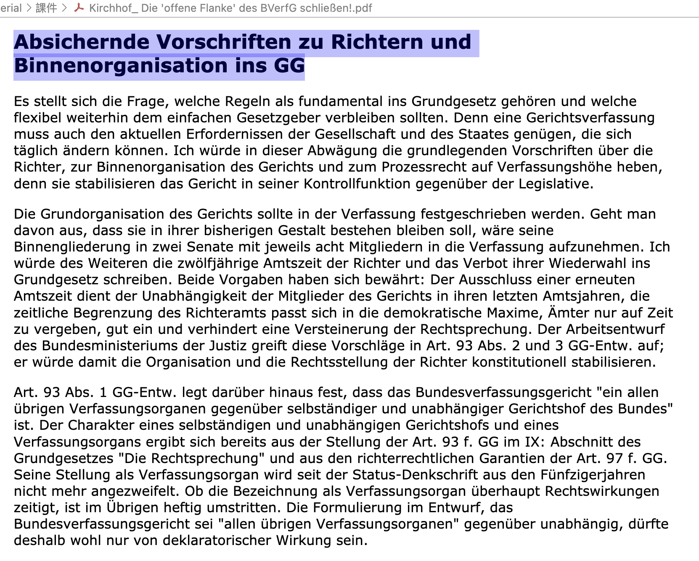

# W13 0513

高質紙本報刊

南德日報

鏡報

也有八卦畫報

---

三年前，老師開課時

討論

疫情期間

•	台灣：由「中央流行疫情指揮中心」統一指揮，透過《傳染病防治法》第17條啟動指揮體系，整合行政資源、統一發布政策、資訊透明且即時。地方政府依指揮中心指示執行，具高度集中化與執行力。

•	德國：初期採取聯邦制下的分權應對，即由聯邦議會頻繁修法調整《感染保護法》（Infektionsschutzgesetz, IfSG），但具體措施由各邦政府自行決定與執行。因各邦對封鎖、口罩令、學校停課等標準不一，出現政策碎片化與防疫效率低下的問題。
後期，因應變異株傳播與疫情反覆，德國修法引入所謂的「Bundesnotbremse（聯邦緊急剎車機制）」，依據確診感染率（如每10萬人7日內新增超過100人）作為統一標準，將特定傳染病防控權限集中到聯邦層級，例如學校停課、宵禁、社交限制等措施由聯邦直接決定，提升整體一致性與反應速度。

---

這學期內容：

1. 國家法課本段落
2. 聯邦憲法法院判決+簡評
3. 基本法93-94

---

上禮拜

聯邦眾議院總理選舉

整套流程的實際運作，完全照著（這學期唸的）教科書！

第一輪居然沒選上

【看守總理又被叫回來30分鐘】

第二輪才選上

---

這禮拜講到 GG 93

下禮拜再開始講 GG 94

以及

[text](file:///Users/iw/Documents/NTU/1132/1132_German_Legal/_material/%E8%AA%B2%E4%BB%B6/Kirchhof_%20Die%20'offene%20Flanke'%20des%20BVerfG%20schlie%C3%9Fen!.pdf)

Absichernde Vorschriften zu Richtern und
Binnenorganisation ins GG

標題之下

最多準備兩個小節，太多會看不完。

---

期末考事項：

下下次，就完全考試。

2小時

內容比上次多

範圍：判決、聯邦憲法法院相關的修憲。

